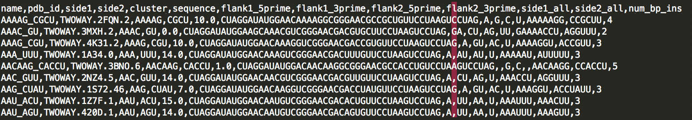

SimulateTectos package:
=======================

---

tools for working with RNAMake's simulate_tectos tool for simulating the tecto RNA system.


simulate_set.py
---------------
accepts a whole set of constructs to run where each line in a csv file is a construct. Will output a csv file will all information in the supplied csv and a new row avg_hit_count that is the number of bound conformations of the tecto system.

```
simulate_set.py -csv CSV 
				[-s S] 
				[-out_file OUT_FILE]
				[-new_ggaa_model]
				[-ggaa_model GGAA_MODEL]
				[-extra_me EXTRA_ME]
				[-extra_motifs EXTRA_MOTIFS]
				[-print_command]
				[-n N]
				[-v]
				[-max MAX]
				[-simulation.temperature SIMULATION.TEMPERATURE]
				[-simulation.steric_radius SIMULATION.STERIC_RADIUS]
				[-simulation.cutoff SIMULATION.CUTOFF]
```

### examples:
```
simulate_set.py -csv examples/0/test_set.csv -out_file examples/0/results.csv
```

where:
test_set.csv


possible columns for csv file:

Column  | Description
------------- | -------------
fseq		    | sequence of flow peice 
fss			    | secondary structure of the flow peice in dot bracket notation
cseq			 |	sequence of the chip peice 
css			    | secondary structure of the flow peice in dot bracket notation
s				 | number of steps in the monte carlo
n				 | number of independent monte carlo runs, will return the averaged hit_count of all the runs (default: 1,000,000)
extra_me		 | extra motif ensemble file, allows for user supplied motif ensemble for a given a motif sequence/secondary structure
simulation.temperature | the temperature for the monte carlo simulation (default: 298K)
simulation.steric_radius | the radius between each steric bead that defines a steric clash (default: 2.2)
simulation.cutoff | the cutoff between the target and current basepair that defines a hit (default: 4.5)

For each row in the csv file a value MUST be defined, pd.nan is not a viable option.

Values can be overrided at command line, if number of steps is specified at command line and is in the csv, the command line will override the csv value. command line options are options that you want to be included for all rows.

ALL other rows that are not one of these above will be igored and copied over the the result .csv


generate_pdbs_of_clusters.py
---------------
given a csv file with the cluster information outputs the pdbs of each 

```
generate_pdbs_of_clusters.py -csv CSV 
						    [-cluster_dir CLUSTER_DIR]
```

### examples: 

```
generate_pdbs_of_clusters.py -csv examples/1/pdb_junctions_subset.csv -cluster_dir examples/1/clusters
```

where pdb_junctions_subset.csv is:



required columns are described below if one of these is not included will return an error

Column  | Description
------------- | -------------
pdb_id | the RNAMake motif id, if is null will assume is a wc helix instead of a motif
side_1 | first strand of motif from 5' to 3'
side_2 | second strand of motif form 5' to 3' 
cluster | the cluster number
flank1_5prime | the sequence before the 5' side_1 sequence 
flank1_3prime | the sequence after the 3' side_1 sequence
flank2_5prime | the sequence before the 5' side_2 sequence 
flank2_3prime | the sequence after the 3' side_2 sequence
side_1_all | the entire first strand of sequence from 5' to 3'
side_2_all |  the entire second strand of sequence from 5' to 3'


generate_motif_ensemble.py
--------------------------
given a set of members of motifs to represent a ensemble of states generate a motif ensemble that can be supplied to simulate_tectos. This script generates both the ensemble and if supplied the sequences to use the ensemble for can create a csv that can be directly supplied to simulate_set.py

```
generate_motif_ensemble.py -csv CSV
						   [-sequences SEQUENCES]
                           [-me_outfile ME_OUTFILE]
                           [-run_outfile RUN_OUTFILE]
```

### examples: 

```
generate_motif_ensemble.py -csv examples/2/cluster.csv -sequences examples/2/cluster_sequences.csv

outputs:
# of ensemble members: 23
done!, run:
python simulate_set.py -csv run.csv
```


