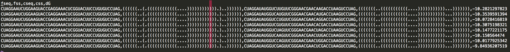

SimulateTectos package:
=======================

---

tools for working with RNAMake's simulate_tectos tool for simulating the tecto RNA system.


simulate_set.py
---------------
accepts a whole set of constructs to run where each line in a csv file is a construct.

```
simulate_set.py -csv CSV 
				[-s S] 
				[-out_file OUT_FILE]
				[-new_ggaa_model]
				[-ggaa_model GGAA_MODEL]
				[-extra_me EXTRA_ME]
				[-extra_motifs EXTRA_MOTIFS]
				[-print_command]
				[-n N]
				[-v]
				[-max MAX]
				[-simulation.temperature SIMULATION.TEMPERATURE]
				[-simulation.steric_radius SIMULATION.STERIC_RADIUS]
				[-simulation.cutoff SIMULATION.CUTOFF]
```

###examples:
```
simulate_set.py -csv examples/0/test_set.csv -out_file examples/0/results.csv
```

where:
test_set.csv




